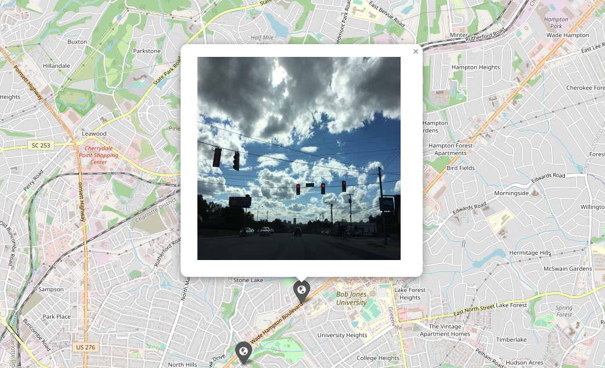
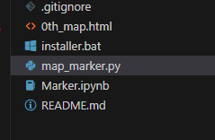

# Map_Marker_w_Photos

  

## Installation

Use git clone or download the zip from Github to obtain the code.  
The Jupyter notebook demonstrates how the code works. The Python script is the standard routine.  
Before you run the Python script, make sure that you have Python installed, then execute installer.bat to install the dependencies. To use the Python script, run
~~~
python3 map_marker.py folder_path_1 folder_path_2 ... 
~~~
where folder_path is the file path to the folder containing the pictures you are interested in putting on a map.  
If you don't want to run the script on your local computer, you can run the Jupyter notebook in Google Colab by clicking the "Open in Colab" when you open the notebook in Github. Don't forget to upload the pictures to Colab when you do so. 

## Result
  
The above image shows the result of the code.  
  
After the software finished running, you'll see things like "0th_map.html" or "1th_map.html." These are the html produced by the Python script. They will locate **AT** the folder from which you run the Python script. Use a browser to see the resulting html. 

## Host A Website
A Django project that allows you to host this software as a website is provided in the mark_on_map folder. To start the web server, go to the mark_on_map folder and run
~~~
python3 manage.py runserver 0.0.0.0:{port}
~~~
where {port} will be replaced by the port number you desire. If you have no idea about port, just use 8000.  
After the server is running, open your browser and type 
~~~
IP:{port}/mark
~~~
in the address bar, where IP is you IP address or domain name and {port} is the number you entered above.  
Use Control + C to stop the server. 
WARNING: the provided Django code is not a production server. There are no guarantee for the security of the server. s

## Note:

1. Adjustment of photo metadata in IPhone will not be reflected in the EXIF data despite what some articles have told you.

	1. You can verify this yourdelf by adjusting the photo, upload it to a EXIF reader website, and see it yourself.

	2. You can also right click the image, go to details, and see the metadata, aka EXIF data, to verify it yourself.

	3. However, you can see the adjusted metadata using another IPhone correctly.

	4. My guess is that when IPhone adjusts the photo, it does not overwrite the exif data but add info about how to get to the desire value.

2. You NEED to enable GPS tracking when taking the photos for this software to work.